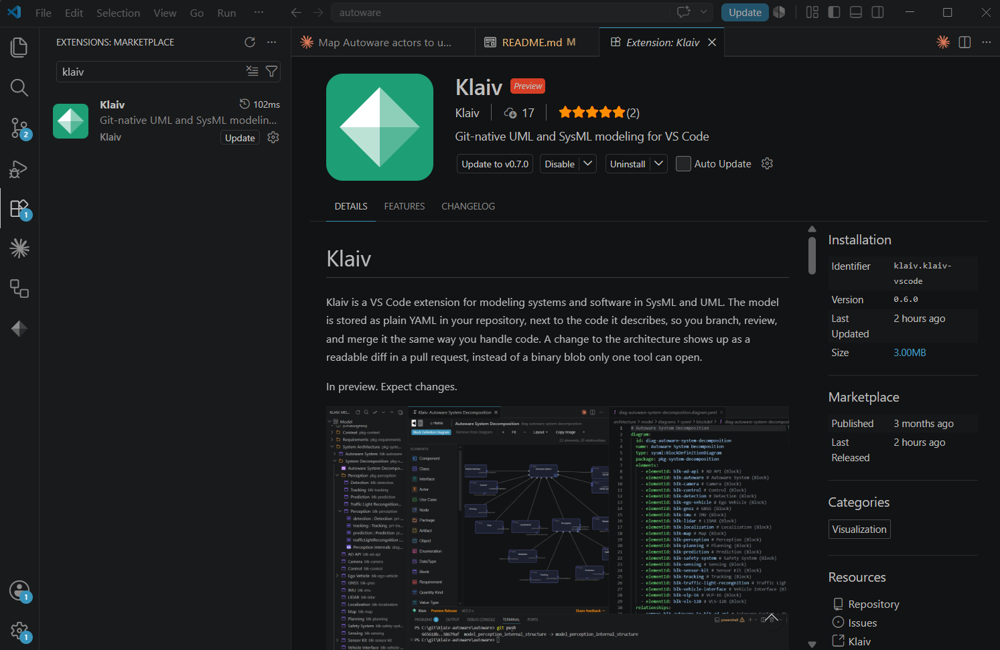
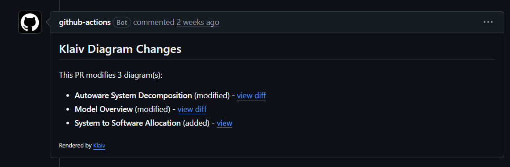

# Autoware, modeled in Klaiv

An architecture model of [Autoware](https://github.com/autowarefoundation/autoware), the open-source autonomous-driving stack, built with [Klaiv](https://github.com/klaiv-dev). The model is SysML and UML kept as plain YAML, versioned in git, and reviewed as rendered diagram diffs on pull requests.

> This is a demo fork. The Autoware source tree is unchanged; the model is the only thing added, and it lives entirely under [`architecture/`](architecture/). The idea was to run Klaiv against a large, real codebase rather than a toy example.

<!-- SCREENSHOT (hero): the "Model Overview" diagram open in VS Code with the Klaiv explorer visible. -->

## What is this?

[Klaiv is a VS Code extension](https://marketplace.visualstudio.com/items?itemName=Klaiv.klaiv-vscode&ssr=false#overview) for architecture modeling. Instead of keeping diagrams in a binary file, it stores the model as YAML next to the code:

- Each element, relationship, and diagram is a small YAML record you can read and diff.
- The model lives in the repo, so branches, PRs, and history work the way they do for code.
- A GitHub Action (requires setup) renders diagram changes as before/after SVGs and posts them on the pull request.
- UML and SysML ship as built-in profiles, and a project can add its own element, relationship, and diagram types.

The model here uses all of that. It spans UML, SysML, and a custom profile, with names, topics, parameters, and message types taken from the actual Autoware source.

## What's inside

The model sits under [`architecture/model/`](architecture/model/) and runs from high-level context down to the ROS 2 topic graph. The Preview column links to the pull request where Klaiv's diagram-diff action rendered each one, so you can see the diagram without installing anything.

### Context and requirements
| Diagram | Type | Shows | Preview |
|---|---|---|---|
| Operating an Autonomous Vehicle | SysML Use Case | Actors and goals for the vehicle in service | [#4](https://github.com/klaiv-dev/autoware/pull/4) |
| Developing and Testing Autoware | UML Use Case | Developer and tester workflows | [#4](https://github.com/klaiv-dev/autoware/pull/4) |
| Crosswalk Safety Requirements | SysML Requirement | Safety requirements with satisfy / verify / derive | [#5](https://github.com/klaiv-dev/autoware/pull/5) |

### System structure (SysML)
| Diagram | Type | Shows | Preview |
|---|---|---|---|
| Model Overview | Block Definition | Top-level map and entry point | [#28](https://github.com/klaiv-dev/autoware/pull/28) |
| Autoware System Decomposition | Block Definition | The subsystem blocks: sensing, localization, perception, planning, control, and so on | [#6](https://github.com/klaiv-dev/autoware/pull/6) |
| System Interfaces | Block Definition | Interface blocks and ports | [#8](https://github.com/klaiv-dev/autoware/pull/8) |
| Value Types, Units, Quantity Kinds | Block Definition (×3) | The SysML value type, unit, and quantity-kind chain | [#8](https://github.com/klaiv-dev/autoware/pull/8) |
| Logical Interfaces | Block Definition | Value-typed logical message blocks | [#8](https://github.com/klaiv-dev/autoware/pull/8) |
| System to Software Allocation | Block Definition | Allocation of system functions to software | [#12](https://github.com/klaiv-dev/autoware/pull/12) |
| Autoware Internal Structure | Internal Block | Internal parts and connectors | [#9](https://github.com/klaiv-dev/autoware/pull/9) |
| Perception Internals | Internal Block | Detection, tracking, and prediction pipeline | [#10](https://github.com/klaiv-dev/autoware/pull/10) |
| Ego Vehicle Composition | UML Composite Structure | The vehicle's parts and how they connect | [#11](https://github.com/klaiv-dev/autoware/pull/11) |

### Software (UML)
| Diagram | Type | Shows | Preview |
|---|---|---|---|
| Planning Pipeline | Component | Planning nodes and their interfaces | [#13](https://github.com/klaiv-dev/autoware/pull/13) |
| Behavior Velocity Plugin Architecture | Component | Plugin host and scene-module plugins | [#14](https://github.com/klaiv-dev/autoware/pull/14) |
| Software Package Structure | Package | ROS 2 package layout | [#17](https://github.com/klaiv-dev/autoware/pull/17) |
| Software Messages | Class | Message datatypes that realize the logical interfaces | [#16](https://github.com/klaiv-dev/autoware/pull/16) |
| Crosswalk Module Internals | Class | Classes inside the crosswalk scene module | [#15](https://github.com/klaiv-dev/autoware/pull/15) |

### Behavior
| Diagram | Type | Shows | Preview |
|---|---|---|---|
| Localization Initialization | Sequence | Pose initialization handshake | [#18](https://github.com/klaiv-dev/autoware/pull/18) |
| Set Route & Engage | Sequence | Route request through to engage | [#19](https://github.com/klaiv-dev/autoware/pull/19) |
| Crosswalk Scenario Data Flow | SysML Sequence | Message flow through the crosswalk scenario | [#20](https://github.com/klaiv-dev/autoware/pull/20) |
| Operation Mode | State Machine | Stop, autonomous, local, and remote transitions | [#21](https://github.com/klaiv-dev/autoware/pull/21) |
| Pedestrian Collision State | State Machine | TTC/TTV yield, pass, and ignore states | [#22](https://github.com/klaiv-dev/autoware/pull/22) |
| MRM State | SysML State Machine | Minimum-risk-maneuver lifecycle | [#23](https://github.com/klaiv-dev/autoware/pull/23) |
| Crosswalk Yield Decision | UML Activity | Per-object yield or pass decision | [#25](https://github.com/klaiv-dev/autoware/pull/25) |
| MRM Escalation | SysML Activity | Escalation across swimlanes, with fork/join and a merge | [#26](https://github.com/klaiv-dev/autoware/pull/26) |

### Deployment and instances
| Diagram | Type | Shows | Preview |
|---|---|---|---|
| Vehicle Deployment | Deployment | Devices, the Docker runtime, and deployed artifacts | [#24](https://github.com/klaiv-dev/autoware/pull/24) |
| Sample Vehicle Configuration | UML Object | The `sample_sensor_kit` hardware as classified instances with slot values | [#27](https://github.com/klaiv-dev/autoware/pull/27) |

### Custom types
| Diagram | Type | Shows | Preview |
|---|---|---|---|
| Planning ROS Graph | custom `Ros2GraphDiagram` | User-defined `Ros2Node` elements joined by `TopicFlow` edges with real topic labels | [#28](https://github.com/klaiv-dev/autoware/pull/28) |

That last diagram checks that user-defined types work everywhere they need to: the palette, storage, validation, and rendering. The types are declared in [`architecture/model/profiles/`](architecture/model/profiles/).

## View the model in VS Code

### 1. Install
- [Visual Studio Code](https://code.visualstudio.com/)
- The [Klaiv extension](https://marketplace.visualstudio.com/items?itemName=Klaiv.klaiv-vscode) from the VS Code Marketplace, or search "Klaiv" in the Extensions panel.

<p align="center">
  
</p>
<p align="center"><sub>Search "Klaiv" in the Extensions panel to find and install it.</sub></p>

### 2. Clone
```bash
git clone https://github.com/klaiv-dev/autoware.git
cd autoware
```

### 3. Open
Open the repository (or just the [`architecture/`](architecture/) folder) in VS Code. Klaiv reads the manifest at [`architecture/klaiv.yaml`](architecture/klaiv.yaml), indexes the model, and opens the explorer. It starts on the Model Overview diagram, set by `startDiagram: diag-model-overview`.

From there you can:
- Browse the diagrams from the explorer.
- Click an element that has a linked diagram to open it. A subsystem block, for example, opens its internal structure.
- See validation issues flagged inline as you edit, with fixes suggested in place.
- Edit on the canvas. Changes save back to the YAML under [`architecture/model/`](architecture/model/).

<!-- SCREENSHOT: a behavioral diagram (e.g. "MRM Escalation") open on the Klaiv canvas. -->

## Diagram diffs on pull requests

The model was built one diagram per pull request. When a PR touches `architecture/**.yaml`, the [`klaiv-diagram-diff`](.github/workflows/klaiv-diagram-diff.yaml) workflow runs the `klaiv-dev/diagram-diff-action`. It renders the changed diagrams, keeps the images on a separate previews branch so they stay out of the main history, and leaves a single before/after comment on the PR. A reviewer sees the diagram that changed instead of reading the YAML behind it.

Browse the modeling PRs: <https://github.com/klaiv-dev/autoware/pulls?q=is%3Apr>

<p align="center">
  
</p>
<p align="center"><sub>What the Klaiv action posts on a pull request: a comment listing the changed diagrams, each linking to its rendered diff.</sub></p>

### Setting it up in your own repo

It's a single workflow file, [`.github/workflows/klaiv-diagram-diff.yaml`](.github/workflows/klaiv-diagram-diff.yaml). Copy it into your repo. It uses `klaiv-dev/diagram-diff-action` and needs two permissions: `contents: write` (to push the rendered SVGs to the previews branch) and `pull-requests: write` (to post the comment). The [action's repo](https://github.com/klaiv-dev/diagram-diff-action) has the full setup.

## Repository layout

```
architecture/
├── klaiv.yaml                 # project manifest (schema version, start diagram)
└── model/
    ├── diagrams/              # diagrams (uml/, sysml/, custom/)
    ├── elements/              # blocks, components, classes, state machines, instances, ...
    ├── relationships/         # associations, compositions, dependencies, flows, ...
    ├── profiles/              # uml/ and sysml/ custom.yaml (stereotypes and the custom ROS 2 types)
    └── layout/                # per-diagram node positions
```

`elements/` and `relationships/` hold the model itself. A file under `diagrams/` is a view into that model, not a separate copy of it. Node positions live in `layout/`, kept separate from meaning, so moving a box on the canvas changes only a layout file and the semantic diff stays clean.

Everything else in the repository is upstream Autoware, untouched.

## About the model

- The names, topics, parameters, and message types are the real ones from the Autoware code, for example `behavior_velocity_planner`, the `sample_sensor_kit`, and the MRM behaviors.
- One thing in the model is not in Autoware: a logical SysML interface layer of value-typed blocks that the software messages «realize». It's there to show how interfaces can be modeled that way, not because the stack is built like that.
- The diagrams were picked so each Klaiv diagram, element, and relationship type gets used at least once. That covers state machines with entry/exit/guards/triggers, activities with swimlanes and fork/join/merge, object diagrams with slots, and the custom profile types.

## Relationship to upstream Autoware

This is a fork of [autowarefoundation/autoware](https://github.com/autowarefoundation/autoware) made to demo Klaiv. The Autoware software isn't modified; the model is self-contained under [`architecture/`](architecture/). The upstream Autoware CI is turned off on this fork, and only the Klaiv diagram-diff Action runs.

For anything about Autoware itself (installation, the stack, the community), see the [upstream repository](https://github.com/autowarefoundation/autoware) and the [Autoware documentation](https://autowarefoundation.github.io/autoware-documentation/main/).

## License

Same as upstream Autoware. See [LICENSE](LICENSE).
